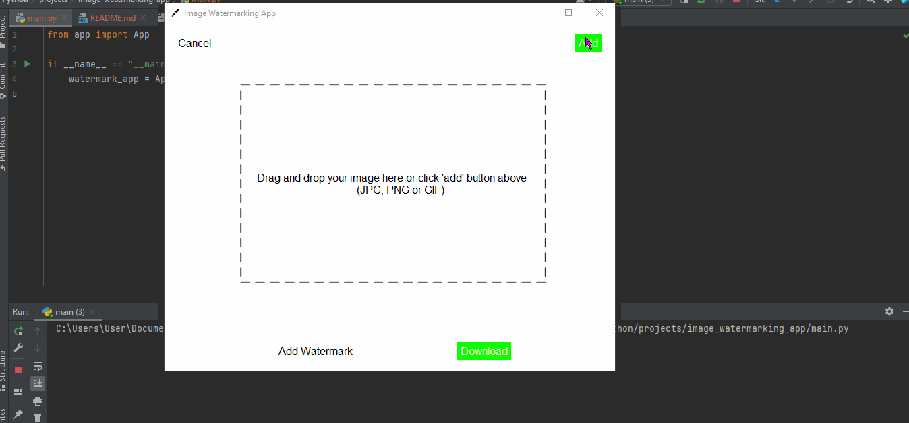
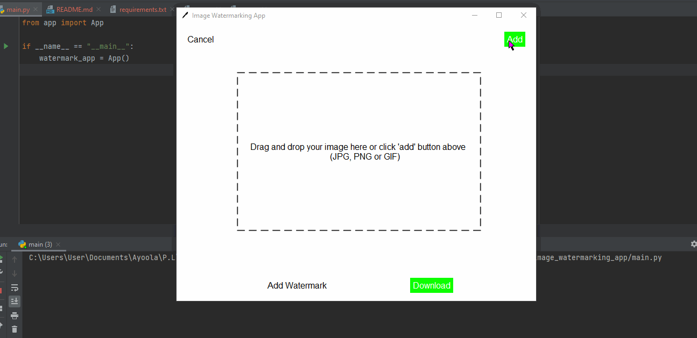
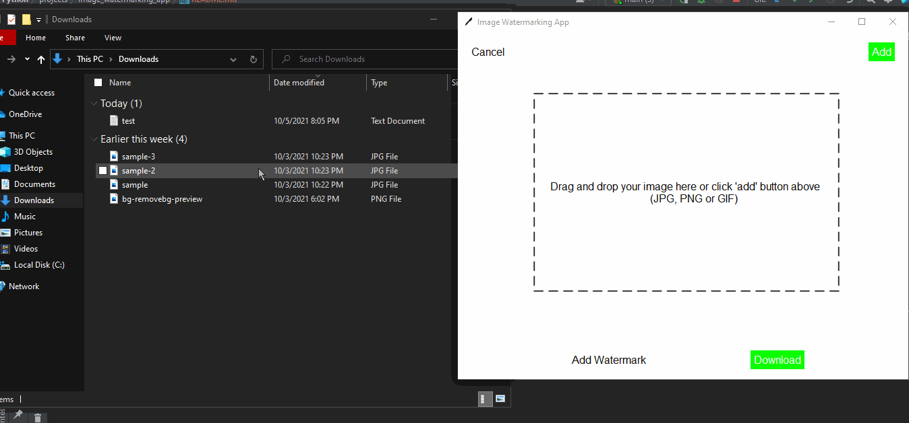
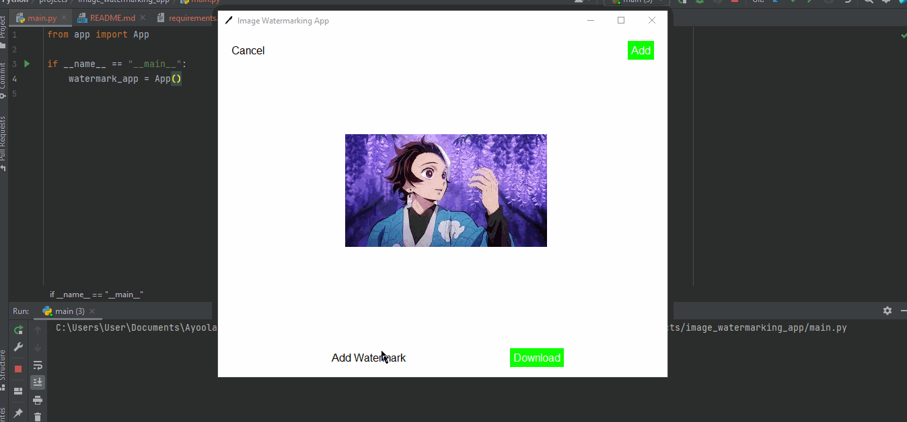
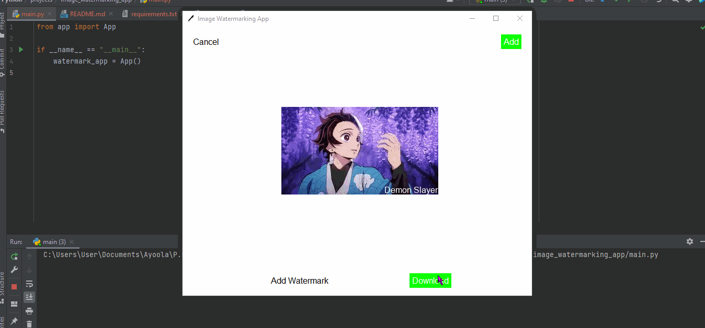

Cross-platform python Desktop GUI for adding a 
watermark to an image.

# Prerequisite
- Works with python version >= 3

# Solution Walkthrough


# Table of Contents
- [Getting started](#getting-started)
- [Features](#features)

## Getting Started
- You can either fork this repository **OR** get your own
local copy by cloning this repo using the command below:
```commandline
git clone https://github.com/Josh-Ay/image-watermarking-app.git
``` 
- Install all the packages in the `requirements.txt` file.
- Go this [site](https://sourceforge.net/projects/tkdnd/)
here to download TkDND which is an extension that adds 
native drag & drop capabilities to the Tk toolkit.


- After downloading, extract the files
- ### For windows
  - Navigate to where your python was downloaded which is: 
  `"C:\Users\[name of your pc]\AppData\Local\Programs\Python\Python[version]"`
  - **Copy** the downloaded folder i.e. 'tkdnd2.8' directory and
  **paste** it in the `tcl` folder


- ### For OSX
  - Navigate to where your python was downloaded
  - **Copy** the downloaded folder i.e. 'tkdnd2.8' directory
  and **paste** it in the `/Library/Tcl` folder


- Run the `main.py` file.


## Features
- ### Select image from device



- ### Drag and drop image



- ### Add watermark to image


- ### Download watermarked image to device
